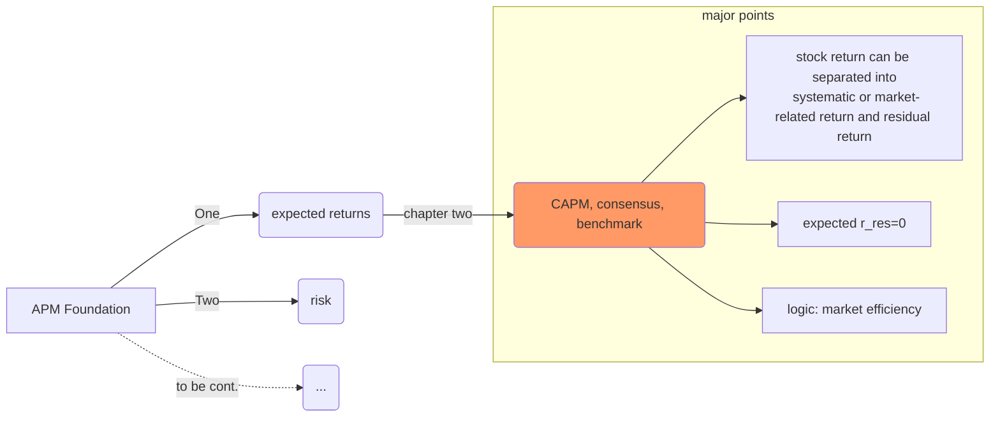

Chapter 2: Consensus Expected Returns: The Capital Asset Pricing Model
======================================================================
+ This is the first chapter of part one: Foundation.

+ where are we now?

+ our attitude to CAPM: humility, `it turns out that much of the analysis originally developed in support of the CAPM can be turned out to the task of quantitative active management.`

### Introduction
+ **topic1**: why CAPM is better than historical average returns as estimate of consensus expected return?
> 1. average return contain sample errors. If volatility of hisorical return is $\sigma$, and the length of historical period is $\gamma$, then the stdandard deviation of average historical return is about $\frac{\sigma}{\sqrt{\gamma}}$.
> 2. true stock market changes over time. Not only the universe of stocks change(new stock listed and old stock expire or merge), but also the single stock's intrinsic attributes(such as its capital structure, earnings) can be quite different over time. Historical data is somehow inconsistent and regime-shifted.

+ **topic2**: why is CAPM is better than APT([arbitrage pricing theory](../PART\ TWO\ expected\ returns\ and\ valuation/chapter7\ APT.md)) as estimate of consensus expected return?
> would like to treat APT as a tool for active manager instead a source of consensus expected return.

+ **topic3**: what does `consensus` mean in the framework of CAPM?
> + portfolio selection rule: **mean/variance  preferences +**
> + expected return forecast model: **CAPM +**
> + assume: **risk-free asset exists ->**
> + optimal portfolio: combination of ``market portfolio`` and ``risk-free asset``(with proportions depending on risk tolerence), ``market portfolio`` is the `consensus` portfolio.

### Separation of return(before CAPM)
1. Notation Reminder:
  - $M$: market portfolio, generaly all traded assets; narrowlly, some broad value-weighted index, such as NYSE Composite.
  - $P$: any portfolio.
  - $\beta$: links any stock or $P$ to the $M$.
  - $r_P, r_M$: excess return of portfolio $P$ and market portfolio $M$

2. Define portfolio $P$'s $\beta$:
$$\beta_P=\frac{Cov(r_P, r_M)}{Var(r_M)}=Corr(r_P, r_M)\frac{\sigma_P}{\sigma_M}    \qquad     (2.1)$$
easy to know, $\beta_M=1$ and $\beta_{risk-free}=0$. No bother to prove it(not from definition):
since $r_M=w^T r,\,\beta_M=w^T \beta$, $r$ is columne vector of returns of all stocks and $\beta$ is column vector of betas of all stocks. For stock $i$, $\beta_i=\frac{V_{[i:]} \omega}{\omega^TV\omega}$, which is also the $i$th element of vector $\beta$, so $\beta_M=\omega^T \beta=1$.
$\bigstar$ note that this $\beta$ is forward-looking, forecast of the future; usually based on fundamental attributes o the company.

3. how can we estimate $\beta$?
$$r_P(t)=\alpha_P+\beta_Pr_M(t)+\epsilon_P(t),\quad t=1,2,...T \qquad (2.2)$$
$\bigstar$note that this $\beta$ is realized beta. However, beta shows mean reversion tendency in empirical test, but usually won't cross the boundary of 1.

4. separate return and risk
$$r_P=\beta_Pr_M+\theta_P \qquad (2.3)$$
here, $\theta_P$ is uncorrelated with $r_M$; also $\theta_P$ contains potential $\alpha_P$ and zero mean residual $\epsilon_P$. Then get the variance on both sides:
$$\sigma^2_P=\beta^2_P \sigma^2_M+\omega^2_P \qquad (2.4)$$

### The CAPM
1. Assumptions:
+ all investors have the same expectations, differ only in risk tolerance.
+ expected residual return of each stock is zero: $E(\theta_p)=0$
2. Main Statements:
+ from above: $E(r_P)=\beta_P E(r_M) \qquad (2.5)$
$\bigstar$ note that $r_M$ always has no residual risk even without CAPM. So why our portfolio's residual risk comes from? `overweighting some stocks or underweighting some stocks relative to market portfolio.`
+ logic behind: only systematic risk will be compensated. Beyond systematic risk, there is a zero-game between any deviation from market portfolio(and your conterparts). Since we expect as least "fools" will realize that they earn negative expected return on excess risk, so transfer to hold market portfolio.

### How to Defend APM?
+ investors have ~~same expectations~~ different expectations due to different informaton exposure.
+ CAPM can help:
  - separaing market risk.
  - better control it(if time the market is hard, then maintain a beta close to 1), but your estimate quality relies on estimate of $\beta$.
  - no need to research market reurn $E(r_M)$ or $\mu_M$, instead focus on residual return.

-----------
### Tenchnical Appendix
#### 1. Characteristic Porfolios
> assets have a multitude of attributes, such as beta, PE ratio and etc.

Different portfolios will have different exposure on these attributes. Some unique portfolio will have special exposure on such an attribute; in this way, the portfolio itself can capture or represent this attribute.

Again, announce some notations:
+ $\bf h=$ the percentage weights of any portfolio in each risky asset.
+ $\bf f=$the vector of expected excess returns
+ $\bf \mu=$the vector of expected excess returns under CAPM
+ $\bf V=$covariance matrix of excess returns for the risk assets
+ $\bf \beta=$ vectir of asset betas
+ $\bf e=$vetor of all ones

Let $\bf{a^T}$$= \{a_1, a_2, ..., a_N\}$ be vector of values of attribute and characteristic. Define exposure of portfolio ${\bf h}_P$ to attribute $\bf a$ as $a_p={\bf a}^T {\bf h}_P$.
##### Proposition 1
1. characteristic portfolio has **unit exposure** to attribute and minimum risk:
$$a^Th=1 \newline min\,{h^TVh} \newline {\rm Lagrange\, multiplier:}\,f(m)=h^TVh-m(a^Th-1)$$
take first derivative on $h$: $Vh-ma=0, \, h=mV^{-1}a$, multiply $a^T$ on both sides, $a^Th=ma^TV^{-1}a=1$, so $m=\frac{1}{a^TV^{-1}a}$
$$h_a=\frac{V^{-1}a}{a^TV^{-1}a} \qquad (2A.1)$$
2. variance of $\bf h_a$:
$$\sigma^2_a=h^T_aVh_a=\frac{1}{a^TV^{-1}a} \qquad (2A.2)$$
3. if use $\bf h_a$ as benchmark portfolio, then beta vector of each asset relative to $\bf h_a$ is:
$$\frac{Cov(\bf r,r^T h_a \bf e)}{Var(r_a)}=\frac{\bf Vh_a}{\sigma^2_a}={\bf a} \qquad (2A.3)$$
4. relation between two characteristic portfolios $\bf h_a$ and $\bf h_d$, $a_d$ is portfolio $\bf h_d$'s exposure on attribute $a$ and $d_a$ vice versa:
$$\sigma_{a,d}={\bf h^T_d Vh_a}={\bf h^T_da \sigma^2_a}=a_d\sigma^2_a \qquad\qquad\;\; \newline \sigma_{a,d}={\bf h^T_a Vh_d}={\bf h^T_ad \sigma^2_d}=d_a\sigma^2_d \qquad (2A.4)$$
5. construct new characteristic $a$ from characteristic $d$ and characteristic $f$: $a=\kappa_d d+\kappa_f f$.
$$h_a=\frac{V^{-1}(\kappa_d d+\kappa_f f)}{a^TV^{-1}a}=\frac{\kappa_d \sigma^2_a}{\sigma^2_d}h_d+\frac{\kappa_f \sigma^2_a}{\sigma^2_f}h_f \qquad (2A.5) \newline \frac{1}{\sigma^2_a}=a^TV^{-1}a=a^TV^{-1}(\kappa_d d+\kappa_f f)=\frac{\kappa_d a^T h_d}{\sigma^2_d}+\frac{\kappa_f a^T h_f}{\sigma^2_f}=\frac{\kappa_d a_d}{\sigma^2_d}+\frac{\kappa_f a_f}{\sigma^2_f} \quad (2A.6)$$

##### Portfolio C
here attribute is investment weight:
$$e^T=\{1,1,...,1\}$$
it's easy to see that if $e_P=1$, portfolio $h_P$ is fully invested; $e_P$ measured the position or extent of investment.

Let  $h_C$ be the characteristic portfolio of $\bf e$.  
+ from equation(2A.3), we have ${\bf e}=\frac{\bf Vh_c}{\sigma^2_C}$, which means that any asset has beta of 1 with respect to portfolio $C$.

$\bigstar$ understand: the marginal risk cotribution of asset to portfolio is proportional to its beta. Since $h_C$ has minimum variance, each asset must have identical marginal risk contribution, hence identical beta. The portfolio as a whole has beta of 1, so each asset identical beta must be 1.
+ from equation(2A.4), we have $\sigma_{P,C}^2=e_P\sigma^2_C$; when $e_P=1, \sigma_{P,C}^2=\sigma^2_C$.

##### Portfolio B
here attribute is $\bf \beta$, the benchmark portfolio $\bf h_B$ which vector $\beta$ is defined respect to is also the chracteristic portfolio $\bf h_{\beta}$. $\bf h_B$ has unit beta and minimum variance among all unit beta portfolios.

##### Portfolio q
here attribute is expected excess returns $\bf f$, denote portfolio $q$ as its characteristic portfolio.

`Sharpe Ratio` is introduced : $SR_P=\frac{\bf f_P}{\sigma_p}$

##### Proposition2: portfolio with maximum Sharpe Ratio
