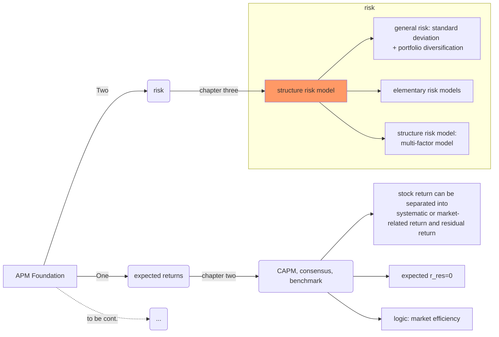
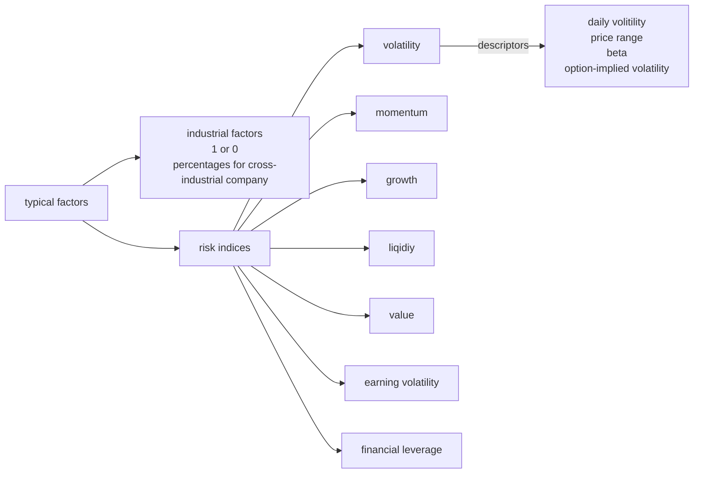

Chapter3 Risk
====
+ This is the second chapter of part one: Foundation.
+ where are we now?

#### 1. Standard deviation
+ if all $N$ assets in portfolio have the same std of $\sigma$ and same pair correlation $\rho$, then the portfolio std will be:
$$\sigma_p=\sigma \sqrt{\frac{1+\rho(N-1)}{N}} \quad(3.4) \newline \sigma_P\rightarrow \sigma \sqrt{\rho}\; , N\rightarrow \infty \qquad(3.5)$$
+ std can't be added directly across stocks or time even if there is no correlation among assets or horizons in the portfolio. However, variance can, so $\sigma_T \propto \sqrt{T}$ and $\sigma^2_T \propto T$.
+ `active risk`: $\psi_P=Std\{r_P-r_B\}$. Active risk depends on active exposure and stock risk, not depends on benchmark holding of the stock.
+ `residual risk`: $\omega_P=\sqrt{\sigma^2_P-\beta^2_P\sigma^2_B}$
+ variance measures the cost of risk which equates risk to an *equivalent* loss in expected return.

**$\bigstar$ then how can wee estimate risk/volatility/std/variance of a portfolio?**

#### 2.Elementary Risk Model
##### 2.1 single-factor diagonal model
start by analyzing returns as: $r_n=\beta_nr_M+\theta_n$, which is similar to CAPM, but they are two different model in at least these ways:
+ CAPM is about expected return, while single-factor risk model is about risk;
+ CAPM's assumption is equilibrium, while single-factor risk model assumes uncorrelated residual returns;
+ single-factor model is a precursor of CAPM, Sharpe developed it in his Ph.D dissertation.

to estimate the covariance matrix:
$\sigma_{n,m}=\beta_n\beta_m\sigma^2_M$ and $\sigma^2_n=\beta^2_n\sigma^2_M+\omega^2_n$ are only needed. So just $N$ betas and $N$ residual variance with 1 market variance, total $2N+1$ estimates.

However, it's unreasonable to assume that residual returns are uncorrelated, since they are constrained by $h^T_M\theta=0$. Generally they are negative related, though stocks in same industry are usually positive correlated.

##### 2.2 same correlation among all stocks
$N$ variance and 1 $\rho$ need to be estimated, $\sigma_{n,m}=\sigma_n \sigma_m \rho$. Used when quick estimate is enough.

##### 2.3 full covariance model, historical data estimate
there are $N(N+1)/2$ independent estimates in covariance matrix, if $T$ periods data we have of each assets, then $NT\ge \frac{N(N+1)}{2}\cdot 2,\;T\ge N+1$. Because we need at least 2 observations to estimate one covariance(otherwise zero).

#### 3.Structural Risk Models
`multiple-factor risk model`: return of stock can be explained by a collection of common factors plus an idiosyncratic element.
+ common factos: forces that affect a group of stocks(like industry, leverage, capitalization, etc.)
+ focus on smaller number of factors and allow stocks to change their exposures to those factors.

**The structure is:**
$$r_n(t)=\sum_k{X_{n,k}(t)b_k(t)+u_n(t)} \qquad (3.16)$$
+ $r_n(t)=$ excess return on stock $n$ from period $t$ to $t+1$
+ $X_{n,k}(t)=$ exposure(or, factor loading) of asset $n$ to factor $k$, estimated at time $t$.
  - industry factor exposure: 1 or 0.
  - other common factors exposure: standardized, average of 0 and std of 1 across stocks.
+ $b_k(t)=$ factor return to factor $k$ during period from $t$ to $t+1$.
+ $u_n(t)=$ stock $n$'s specific return which can't be explained by factors from period $t$ to $t+1$.
+ assume:
  - $Cov\{b_k(t), u_n(t)\}=0$
  - $Cov\{u_n(t), u_m(t)\}=0$

**the risk structure is:**
$$V_{n,m}=X^T_nFX_m+\Theta_{n,m}$$
+ $V_{n,m}=$ covariance of asset $n$ and asset $m$.
+ $X_n, X_m=$ exposure to factors of asset $n$ and $m$.
+ $\Theta=$ specific covariance matrix, diagonal.

#### 4.Choosing the factors
##### 4.1 responses to external influences
or called `macrofactors`:
+ responses to return in bond market
+ inflaion surprise
+ changes in oil price
+ changes in exchange rates
+ changes in industrial production

##### 4.2 cross-sectional comparisons
`fundamental attributes`: dividend yield, analyst' forecast of future earning, ...

`market attributes`: volatility over a past period, return over a past period, turnover, implied volatility, ...

##### 4.3 statistical factors

See more details in [BARRA risk model handbook](barra_handbook_US.pdf).

**how to get risk index exposures?**
1. risk index exposure: weighting the exposures of the descriptors within the risk index.
2. de-range and de-unit, rescale raw exposure across assets:
$$x_{normalized}=\frac{x_{raw}-mean(x_{raw})}{Std(X_{raw})}$$

**how to estimate factor returns**
+ regress excess returns against factor exposures
+ GLS run to effectively estimate factor returns with weights:
  - inverse of observations specific variance
  - square root of market capitalization(empirically, company size doubles, specific variance shrinks by a factor of 0.7)
+ in US equity market, multi-factor models with 50 factors and 1000 assets have average $R^2$ from 30% to 40% using monthly equity returns.
+ for market portfolio:
  - industrial factors play role of intercept, they are more volatile factors
  - market portfolio has nearly zero exposure in risk indices, risk indices pick up extra-market returns.
